# BP-Visionn

Sistema web interno desenvolvido para gestão de tarefas, pendências, contratos e acompanhamento operacional de representantes comerciais.

O projeto nasceu de uma necessidade real de melhorar a supervisão do setor financeiro e operacional da empresa, centralizando informações que antes eram controladas manualmente em planilhas e documentos separados.

Além do desenvolvimento do sistema, o projeto também foi utilizado para aplicação prática de conceitos de Git, GitHub, documentação técnica e práticas de Quality Assurance (QA).

---

## 🚀 Demonstração

Em constante evolução.

| Versão | Status | Última atualização |
|--------|--------|---------------------|
| 1.0 | Em desenvolvimento | Julho/2026 |

---

## 📸 Telas do Sistema

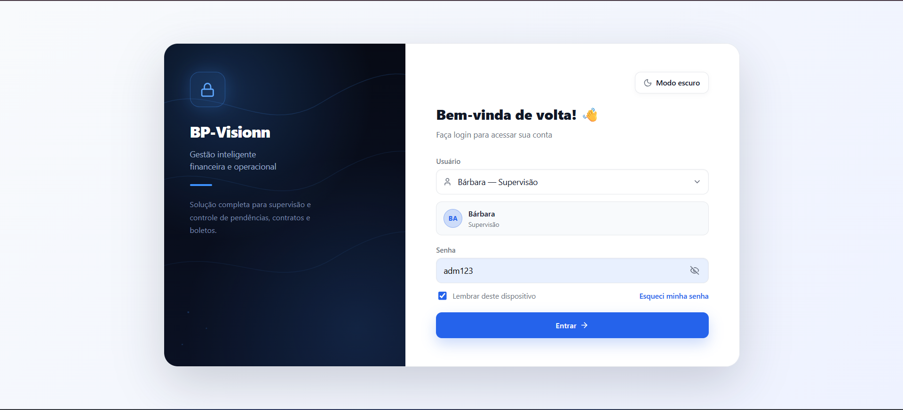

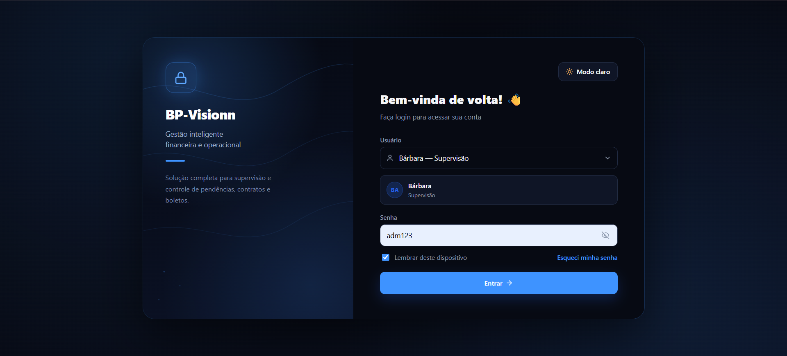

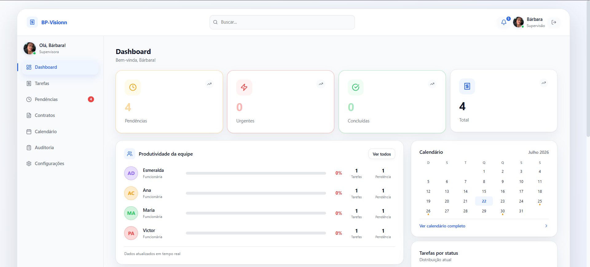

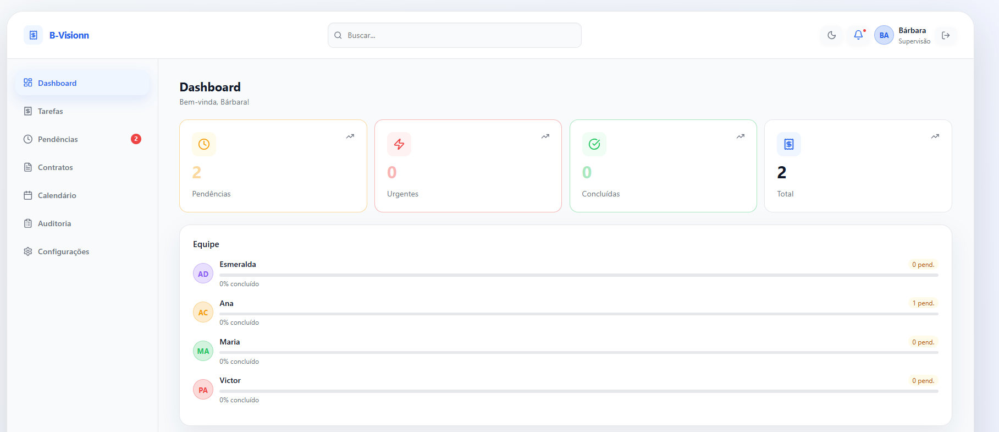

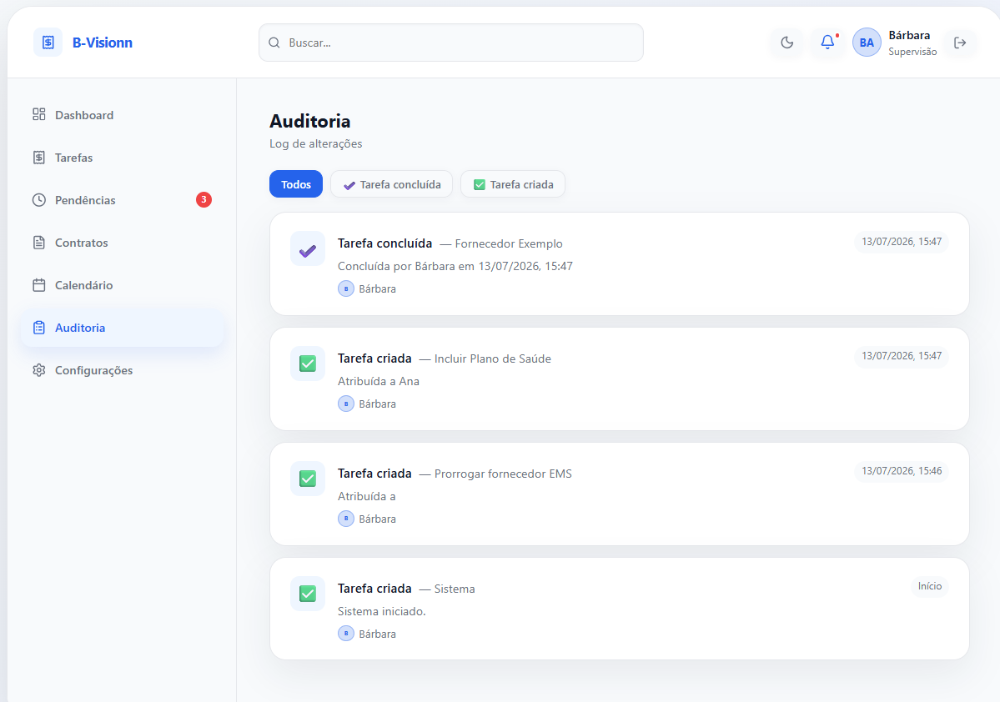

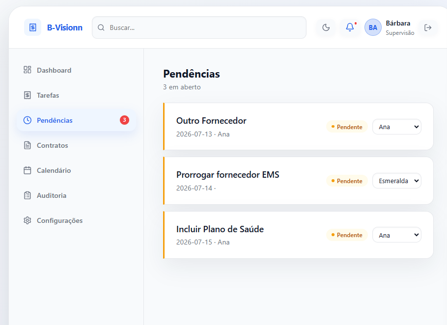

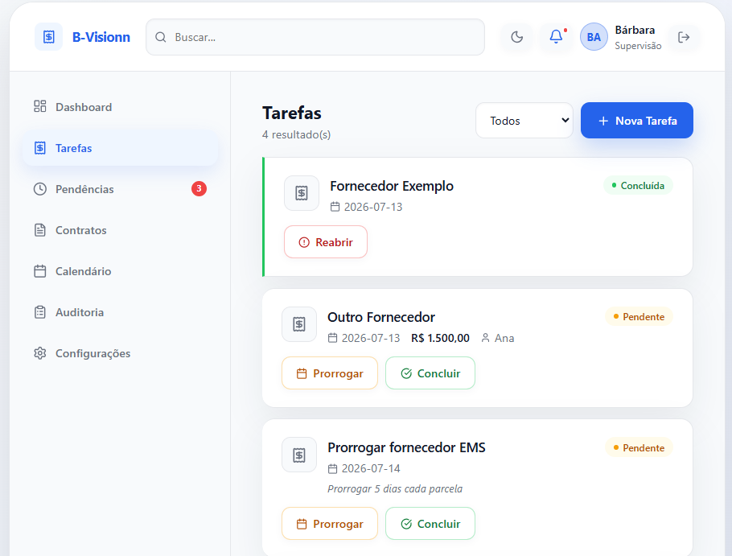

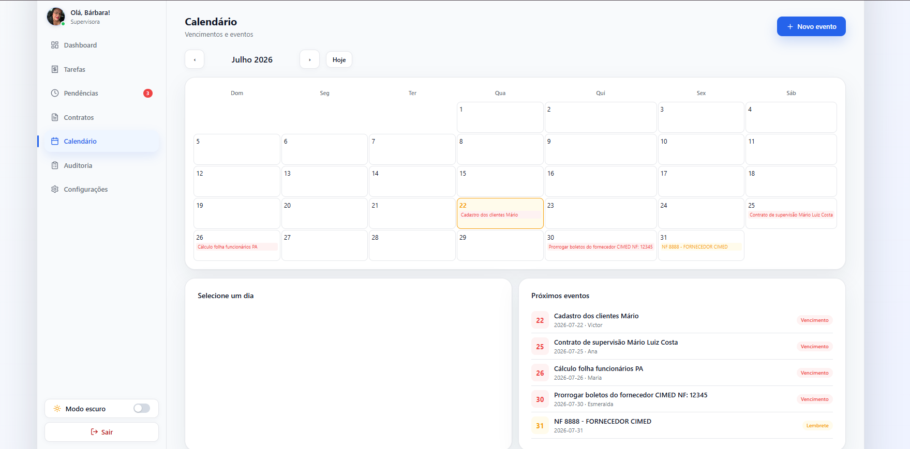

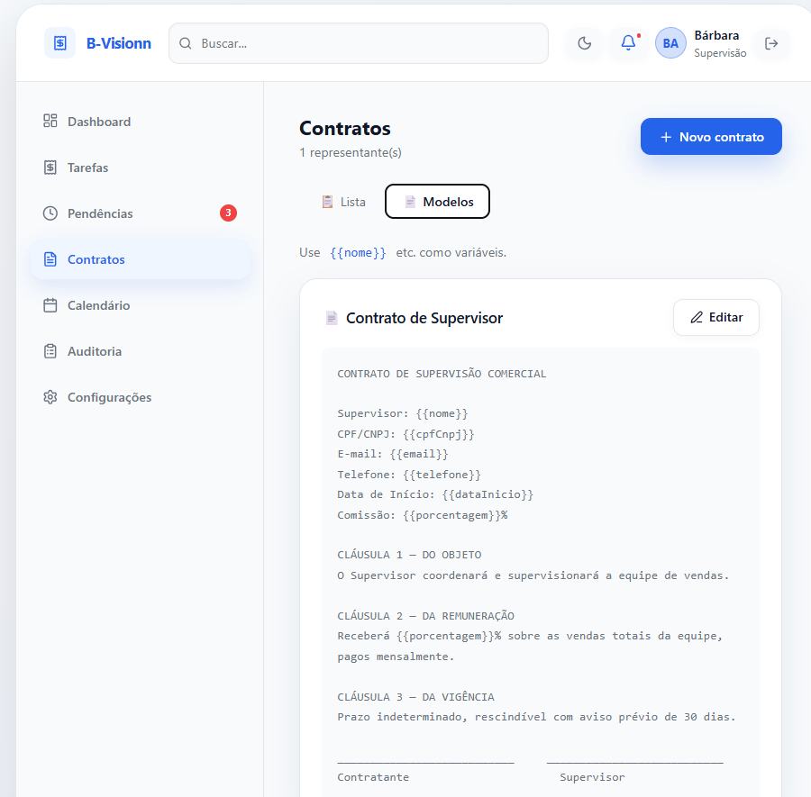

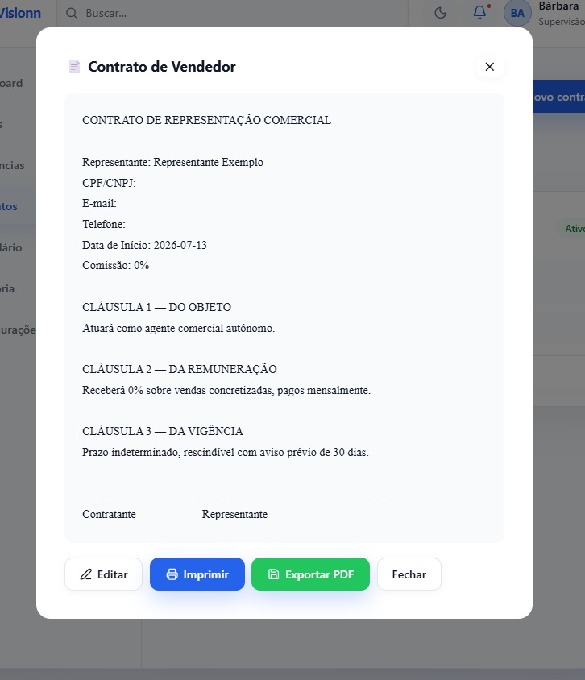

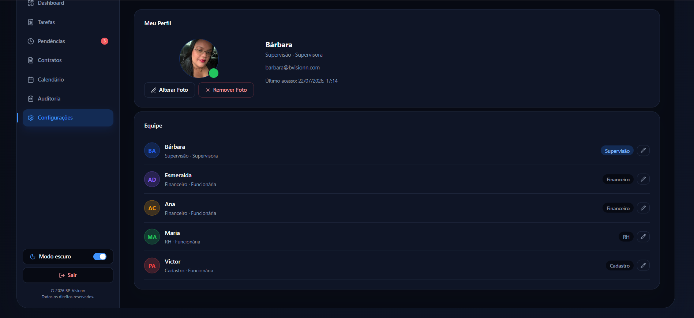

---

## 📋 Sobre o Projeto

Antes do sistema, o acompanhamento das tarefas era realizado manualmente, dificultando o rastreamento das atividades, a distribuição das demandas e a visualização das informações em tempo real.

O BP-Visionn foi desenvolvido para oferecer maior organização, produtividade e controle operacional, permitindo que a supervisão acompanhe indicadores importantes do setor em um único ambiente.

---

## ✨ Funcionalidades

- Dashboard com métricas em tempo real e gráfico de tarefas por status;
- Calendário de vencimentos e eventos, com versão resumida na tela inicial de cada funcionária;
- Gestão de tarefas: criação, edição, exclusão, conclusão, reabertura e prorrogação;
- Aba de pendências com atribuição e troca de responsável;
- Controle operacional dos contratos e geração de documentos a partir de modelos;
- Histórico das alterações realizadas (auditoria);
- Controle de acesso por perfil de usuário (Supervisora e Funcionárias);
- Cadastro de novos usuários da equipe diretamente em Configurações;
- Edição dos dados da equipe (nome, setor e senha) pela Supervisora;
- Recuperação de senha via confirmação de e-mail cadastrado ("Esqueci minha senha");
- Seleção rápida de conta na tela de login;
- Impressão e exportação de documentos em PDF via navegador;
- Modo escuro;
- Interface responsiva;
- Organização das informações em tempo real.

---

## 🚀 Tecnologias Utilizadas

| Tecnologia | Utilização |
|------------|-----------|
| React 19 | Interface e componentes |
| TypeScript | Tipagem do projeto |
| Vite | Ambiente de desenvolvimento |
| Git | Versionamento do código |
| GitHub | Hospedagem do código-fonte |
| Vercel | Deploy e hospedagem da aplicação |
| Impressão do navegador | Geração e exportação de documentos em PDF |
| LocalStorage | Persistência da foto de perfil do usuário |
| CSS Variables | Tema claro e escuro |
| Lucide Icons | Ícones da aplicação |

---

## 🔐 Controle de Acesso

O sistema utiliza controle de permissões baseado em perfis de usuários.

| Perfil | Permissões |
|--------|------------|
| Supervisora | Acesso completo ao sistema |
| Funcionárias | Visualização e gerenciamento das suas atividades |

---

## 🛡️ Segurança

O projeto passou por uma revisão de segurança focada em XSS, controle de acesso por perfil, CSRF, uso de JWT, SQL Injection e validação de dados. Como o BP-Visionn é uma aplicação 100% front-end (sem backend, banco de dados ou autenticação server-side), CSRF, JWT e SQL Injection não se aplicam à arquitetura atual — os pontos abaixo tratam do que de fato foi encontrado e corrigido.

**Falhas corrigidas:**

- **XSS na exportação de documentos (Contratos → Exportar PDF):** o conteúdo do documento era inserido na janela de impressão via `document.write` concatenando HTML bruto, permitindo que texto digitado nos campos do contrato (ou no editor do documento) executasse scripts na nova janela. Corrigido substituindo a montagem por `document.createElement` + `textContent`, que nunca interpreta marcação, e removendo a referência `window.opener` da janela aberta.
- **Bypass de autenticação no login "Entrar com Google":** o seletor de contas autenticava o usuário escolhido com um clique, sem validar senha. Agora a seleção apenas preenche o usuário no formulário de login normal, mantendo a exigência de senha.
- **Exposição de e-mails no seletor de contas:** o mesmo modal exibia o e-mail de todos os usuários, o que combinado ao fluxo "Esqueci minha senha" (que valida apenas o e-mail) permitia iniciar a redefinição de senha de qualquer conta, inclusive da Supervisora. O modal passou a exibir apenas o setor, como no restante do sistema.
- **Inconsistência no controle de acesso por perfil:** a aba Contratos era escondida do menu para quem não é Supervisora/Financeiro, mas o conteúdo não repetia essa checagem na renderização — diferente das demais abas restritas. Padronizado para validar o perfil também no conteúdo, não só na navegação.

**Limitação conhecida da arquitetura:** por não haver backend, todo o controle de acesso e a validação de senha acontecem no navegador, e os dados de todos os usuários (incluindo senhas) ficam carregados na memória da aplicação o tempo todo. Isso é adequado para o uso atual como projeto de estudo/portfólio, mas para um uso em produção com dados financeiros reais, o próximo passo recomendado é migrar autenticação e persistência para um backend dedicado.

---

## ⚙️ Como Executar Localmente

```bash
# Clone o repositório
git clone https://github.com/barbaratechdev/BP-Visionn.git

# Acesse a pasta do projeto
cd BP-Visionn

# Instale as dependências
npm install

# Execute o projeto
npm run dev
```

Acesse:

```
http://localhost:5173
```

---

## ☁️ Deploy (Vercel)

O projeto é uma SPA estática (Vite + React), compatível com o preset "Vite" da Vercel sem configuração adicional:

1. Acesse [vercel.com](https://vercel.com) e importe o repositório `BP-Visionn` do GitHub;
2. A Vercel detecta o framework automaticamente (Build Command: `npm run build`, Output Directory: `dist`);
3. Clique em **Deploy**.

Para gerar o build de produção localmente:

```bash
npm run build
npm run preview
```

---

## 📁 Estrutura do Projeto

```text
src/
├── assets/
├── App.css
├── App.tsx
├── index.css
└── main.tsx

public/

images/

package.json
vite.config.ts
tsconfig.json
README.md
```

---

## 🧪 Quality Assurance (QA)

Durante o desenvolvimento do projeto foram realizadas atividades relacionadas à validação das funcionalidades do sistema, incluindo:

- Testes funcionais;
- Identificação e correção de bugs;
- Validação das regras de negócio;
- Testes das funcionalidades implementadas;
- Testes realizados em ambiente local (localhost);
- Validação das correções aplicadas;
- Documentação das melhorias implementadas.

O projeto continua sendo utilizado como ambiente prático para evolução dos conhecimentos em desenvolvimento Front-end e Quality Assurance (QA).

---

## 🧠 Conceitos Aplicados

- Component-Based Development;
- Git e GitHub;
- Versionamento de código;
- Responsividade;
- UX/UI;
- Controle de permissões por perfil;
- Documentação técnica;
- Quality Assurance (QA);
- Organização e evolução contínua do produto.

---

## 🔄 Melhorias Futuras

As próximas versões do projeto contemplam:

- Melhorias na experiência do usuário (UX/UI);
- Evolução do Dashboard;
- Implementação de automação de testes;
- Melhorias na acessibilidade;
- Novas funcionalidades operacionais;
- Migração da autenticação e persistência de dados para um backend dedicado;
- Evolução contínua da documentação técnica.

---

## 👩‍💻 Autora

**Bárbara Pinon**

- Estudante de Engenharia de Software;
- Desenvolvedora Front-end em formação;
- Interessada em Desenvolvimento Web e Quality Assurance (QA).

> "Este projeto representa não apenas um sistema funcional, mas também a minha evolução prática em desenvolvimento de software, documentação técnica e resolução de problemas reais."
